# (Swift 5, iOS 16): MVVM, Combine, REST API, UIKit & XCTest

The **MVVM** design pattern is the most used architecture in professional **iOS development**, along with functional reactive programming, such as **Combine**, to produce clean, easy-to-read, more maintainable, and testable source code. 

In this project, I used the **Combine** framework to fetch data via a **REST API** and for data binding between the **Views** and the **ViewModels**, as well as, to setup a Timer that refreshes the data every 10 seconds.

All in combination with **UIKit** and programmatically created views and layouts.

 

 

 

## Table of contents
* [MVVM Architectural Pattern](#mvvm)
* [Functional Reactive Programming with Combine](#combine)
* [Unit Tests with XCTest](#unit_tests)

 

 

## MVVM Architectural Pattern

The **MVVM** architectural design pattern allows for a better separation of concerns, by keeping the UI logic separate from the Business logic.

Unlike **MVC**, where the `ViewController` is in charge of presenting the **UI** as well as handling business logic, on **MVVM**, the `ViewController` is only in charge of presenting the **UI**, and requesting its `ViewModel` for ready-to-display data.

 

### The MVVM pattern has 3 components:

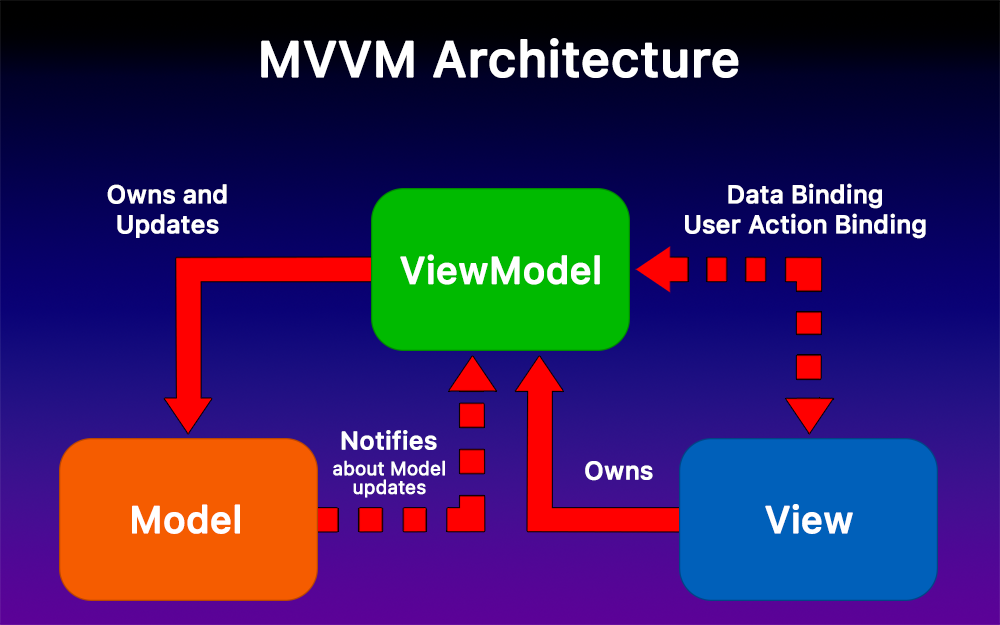 

* **Model:** It is owned by the `ViewModel` and holds the app’s data. Models are usually structs, and are used and updated by a `ViewModel`.

* **View:** It is a `UIViewController` or any subclass of `UIView`, such as, buttons, views, etc. Its only responsibility is to setup its UI and layout, and binding to its `ViewModel` to later request for ready-to-display data.

* **ViewModel:** It is owned by the `View` and it’s responsible for handling the Business logic. It processes the Model’s data and transforms it into values that can be displayed by the `View`.

  - The `ViewModel` is usually a class, so it can be passed around as a reference.

  - The `ViewModel` uses data and user action bindings to communicate with the `View`, which are ways of alerting each other that something has changed.

   

### Examples of Data Bindings:

* **Observables:** Use closures as the listeners for changes.
* **Delegation:** Communication through protocols.
* **Observers:** Use Notification Center to add observers and post changes.
* **Functional Reactive Programming:** Handles asynchronous events over time (e.g., **Combine**, **RxSwift**)

 

### This Project and MVVM:

* My **Models** are structs that conform to **Codable**, where the **JSON** data returned by the **REST API** gets decoded into, to be later used by the `ViewModel`.

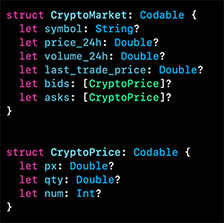 

* My **ViewModels** are in charge of fetching data through the **API** using a service, and transforming it into ready-to-display data. It then communicates through data bindings with the `View` when the transformed data is ready to be handed over.

 

* The **Views'** only concern is to setup the **UI** and layouts programmatically, and request for ready-to-display data from its `ViewModel`.

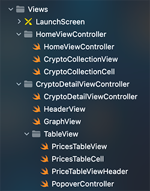 

 

 

## Functional Reactive Programming with Combine

The **Combine** framework allows you to write functional reactive code to handle asynchronous events delivered by a **Publisher** (Observable) over time, and acted on by a **Subscriber** (Observer) who receives those events.

> A very important rule of a subscription is that a **Subscriber** can only have one subscription.

 

### This Project and Combine:

#### Setting up the Publishers and Subscribers

**1.** Created a service protocol to fetch data through an **API**. The data-fetching method returns a `Future`, which is the promise of a single element published asynchronously. This `Future` can be a generic object of type T or an **API** error.

  - I made the published element of a generic type, so it can successfully return any kind of **JSON** format.
  
  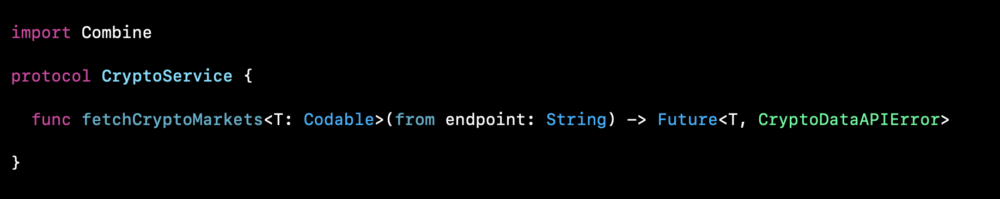 

**2.** Created a **Singleton** class that conforms to the **service protocol**, and implements the data-fetching method.

  - After starting the data task publisher, we must make sure that the **HTTP** response status code is between 200 and 299, so we can get our expected data.
  
   

  - If our data was fetched successfully, we then decode it into one of our models that conforms to `Codable`.
  
   

  - We then subscribe to receive any **API** error that might occur and that will keep us from successfully fetching our expected data.
  
   

  - If everything went well, we then publish our models containing the decoded data.
  
  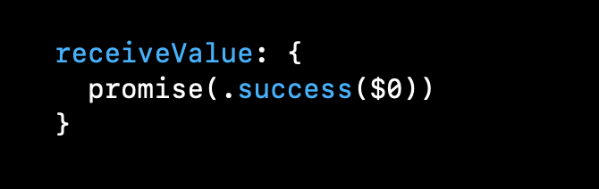 

**3.** Created **Publishers** in the `ViewModel` that will update the `ViewController` with the newly created data.

  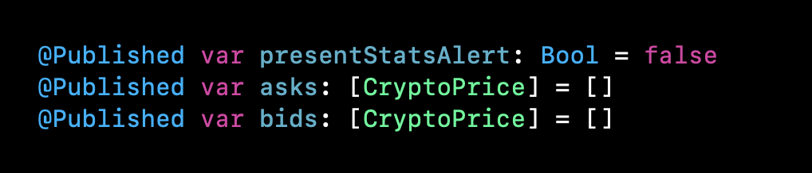 

**4.** We then setup the `ViewController` as the **Subscriber** to the previous **Publisher** through binding, which will listen for new data and update its **UI** accordingly.

   

 

#### Example:

When tapping on a Crypto currency **CollectionViewCell**, the `ViewModel` in charge of fetching the data through the service:

* if successful, it will store the data in the **Publishers** `asks` and `bids`, and the **Subscriber** `ViewController` will then receive the published elements and display them,

* if not successful, then the `ViewModel` will let the `ViewController` know through the `presentStatsAlert` **Publisher**, that it must show an alert to the user before popping the `ViewController` from the **NavigationController**.

 

#### Refreshing Data

Created a `Timer` to trigger a call to refresh the data every 10 seconds, by refetching new data through the **API**.

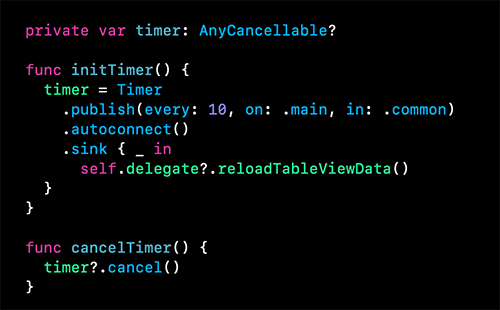 

 

 

## Unit Tests with XCTest

Unit tests are essential to verify that the application works as expected. Writing unit tests save time in the long run since as a developer, you will spend less time fixing bugs in the future.

Apple provides the **XCTest** framework to run these tests. Every subclass of `XCTestCase` must declare a **SUT** (System Under Test), and write tests that run quickly, that are independent from each other, that get the same result after every run, and ideally, that are written in **TDD** fashion. 

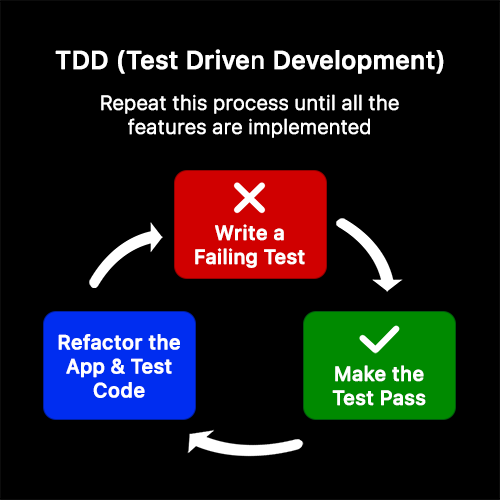 

 

### This Project and Unit Tests:

#### Testing API Endpoints

When fetching data using a **REST API**, we must test that the endpoints being used will successfully return the expected data, instead of an **API** error.

**Example:**

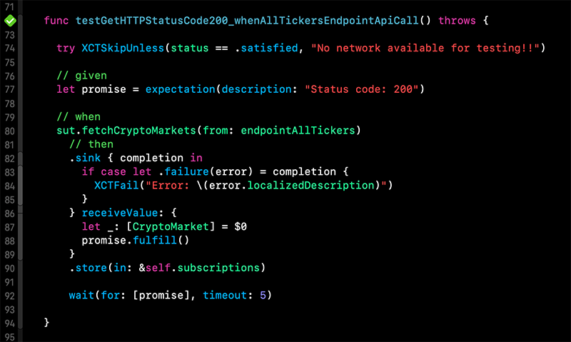 

**1.** We first check that the network is available for testing, otherwise it should skip the test.

**2.** Create an `XCTestExpectation` describing what you expect to happen after the test has been run.

**3.** Start running the service method to fetch the data.

**4.** Subscribe to receive an **API** error if any, and if you get one, then fail the test with `XCTFail()`.

**5.** If no **API** errors are encountered, then fulfill the expectation of passing the test by calling `promise.fulfill()`.

 

#### Testing ViewModels

One of my goals was to reach greater than 85% test coverage for every `ViewModel`. I tested that data would still be published even if some values in the model were nil.

**Example:** `HeaderViewModelTests`

* The **SUT** can be initialized with a nil value at any time.

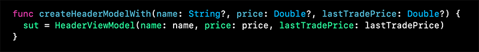 

Here are some of the tests:

* `testGetPriceString_whenLastTradePricePropertyNil()`: If `lastTradePrice` is nil, then a default "$0.00" string must be returned. This string is formatted to the proper currency.

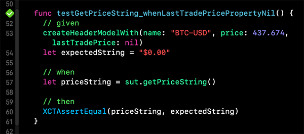 

* `testGetPriceString_whenNamePropertyContainsNoCurrencyString()`: If the Crypto symbol string does not contain a currency substring, then return the price without a currency format.

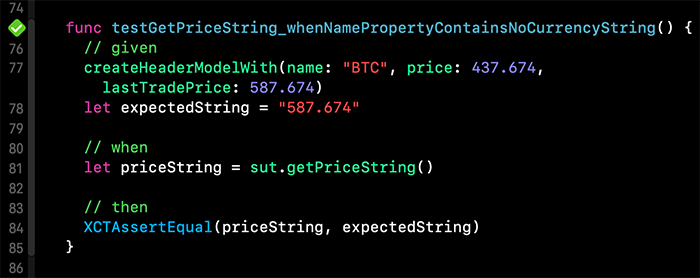 

* `testGetPricePercentageChangeString_whenPricePropertyNil()`: Get the percentage change between two **Doubles** when the divisor is nil.

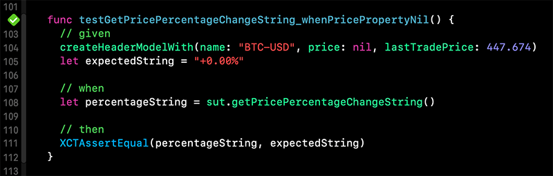 

 

#### ViewModel Test Coverage

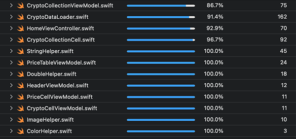 

 

 

### Credits:
* Blockchain.com [REST API](https://api.blockchain.com/v3/)
* [Charts](https://github.com/danielgindi/Charts)
* [Cryptocurrency Icons](https://github.com/spothq/cryptocurrency-icons)

